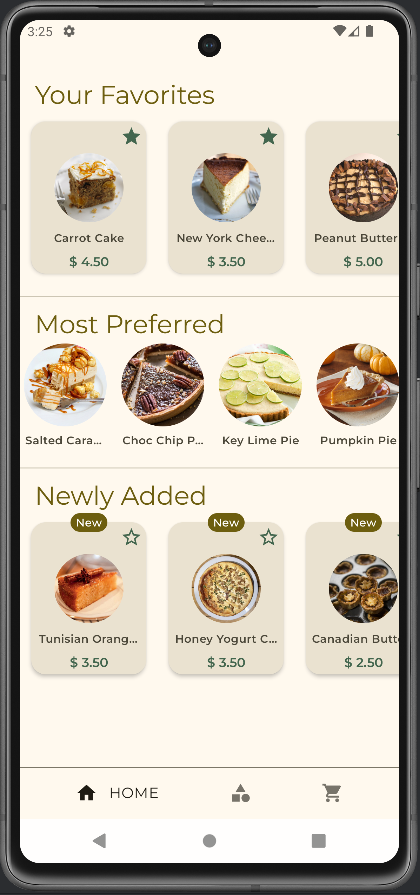
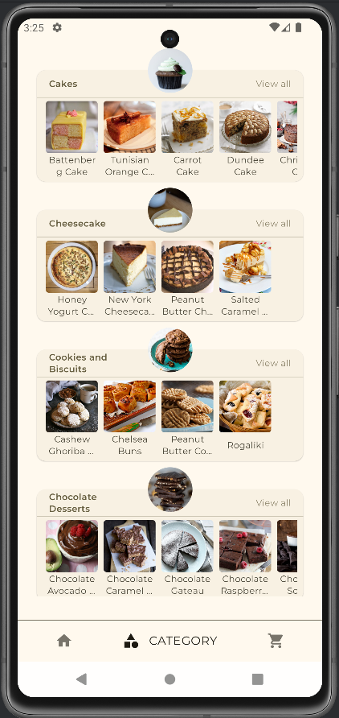
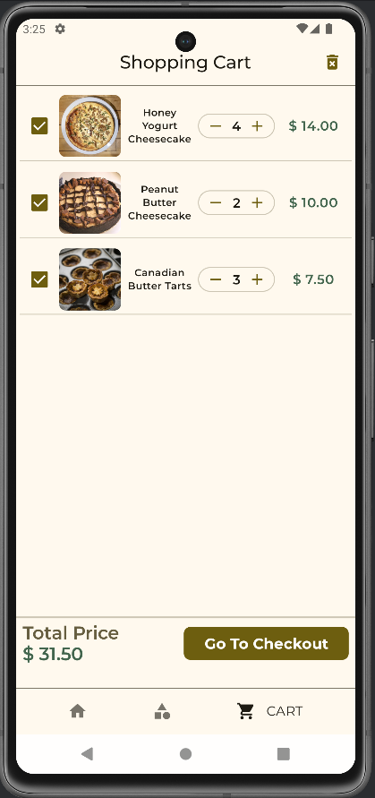
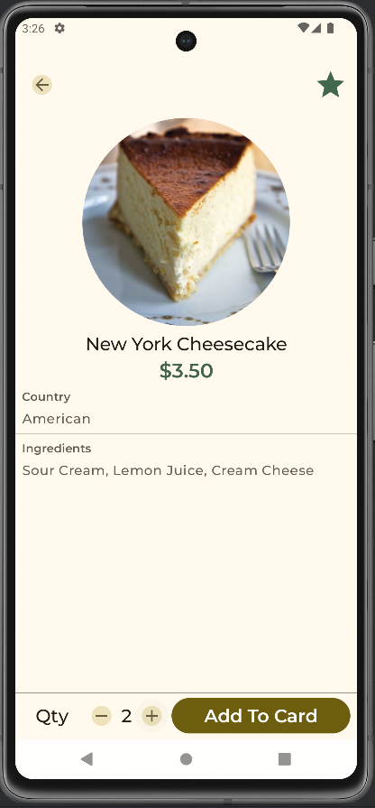
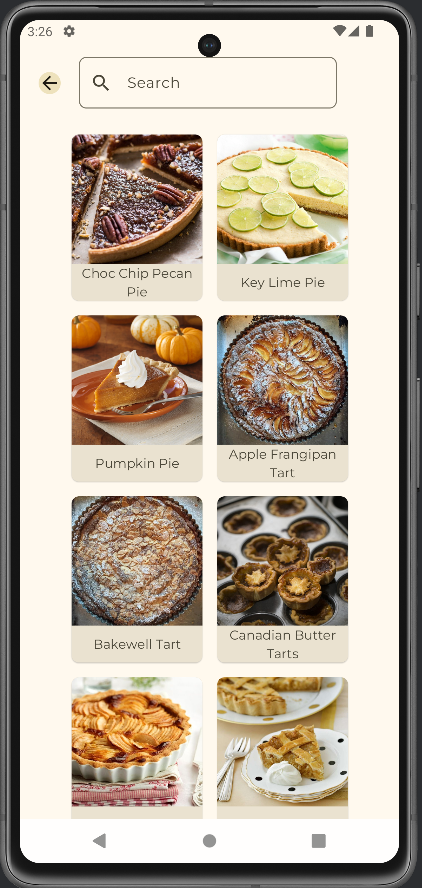

# SweetRealm

SweetRealm is a mobile application for a fictional company selling sweets, allowing users to browse, view details, mark them as favorites, and add them to a shopping cart for purchase.

## Overview

SweetRealm helps users explore a wide variety of sweets, categorized for easy navigation. Users can view detailed information about each sweet, add favorites, and manage their shopping cart for potential purchases.

## Screenshots

## Technologies Used

- Jetpack Compose
- MVVM Architecture
- Navigation Component
- Hilt & Dagger
- Room
- Coroutine
- Flow
- Coil
- Splash Screen

Data for desserts provided by TheMealDB.
