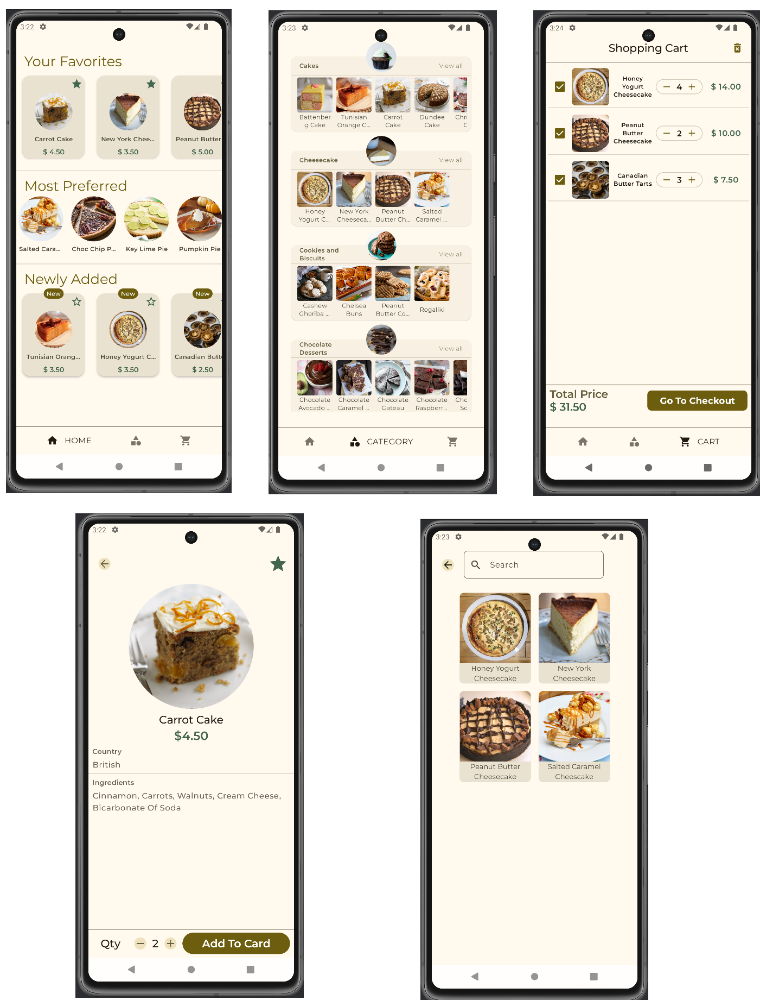

# SweetRealm

SweetRealm is a mobile application for a fictional company selling sweets, allowing users to browse, view details, mark them as favourites, and add them to a shopping cart for purchase.

## Overview

SweetRealm helps users explore various sweets, categorized for easy navigation. Users can view detailed information about each sweet, add favourites, and manage their shopping cart for potential purchases.

## Technologies Used

- Jetpack Compose
- MVVM Architecture
- Navigation Component
- Hilt & Dagger
- Room
- Coroutine
- Flow
- Coil
- Splash Screen

## Screenshots

https://github.com/user-attachments/assets/73dd07d4-772a-4e23-844f-7fcd976895f0

Data for desserts provided by TheMealDB.
